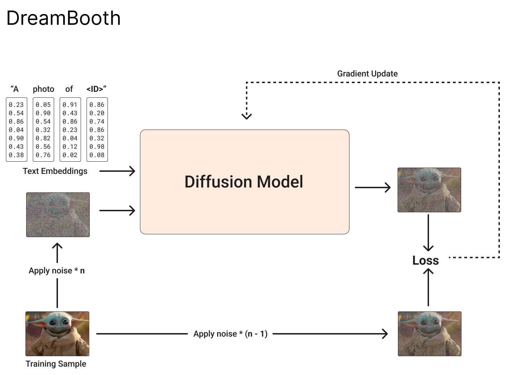

How does **DreamBooth** work? 🤔

Reading more about Generative AI so thought I can explain a little bit about DreamBooth

So the goal is to make the model learn a new token associated to a subject in an image, in our example `<ID>` and *baby yoda (Grogu*).

▪️ The input is the image(s) of your subject
▪️ Noise is added to the image and fed into a diffusion model with the text embeddings
▪️ Noise is added to the image (with less intensity) to the image
▪️ We compare the model's output and the noisy input image
▪️ We update the models weight

The idea is that the model has no clear idea what the special token is, so it will be forced to learn it by comparing it with the original noisy image

The authors also proposed prior preservation, in which you generate some images using a sentence that encapsulate the semantic of your subject. E.g., if you want to train it with your selfies, you will generate `n` images with `A photo of a man/female` and you will condition the model to make sure it preserves the prior knowledge of what a `man/female` is. In my tests, this worked well for some classes, not so great for others.

Props & Cons
🟩 works very well
🟥 need to store all the weights (~6GB)

🔗 [paper](https://arxiv.org/abs/2208.12242)

